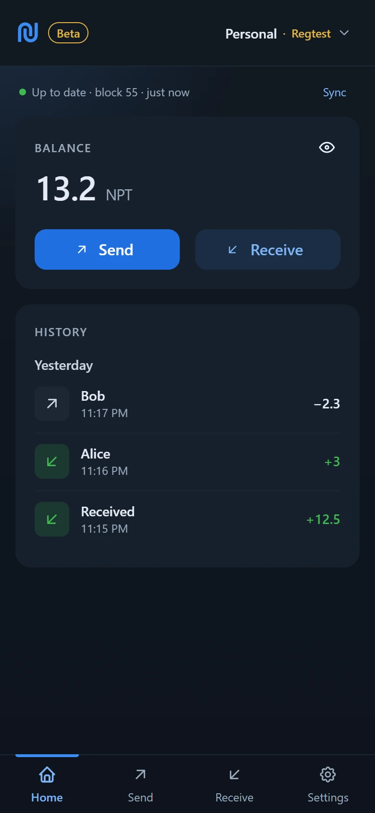
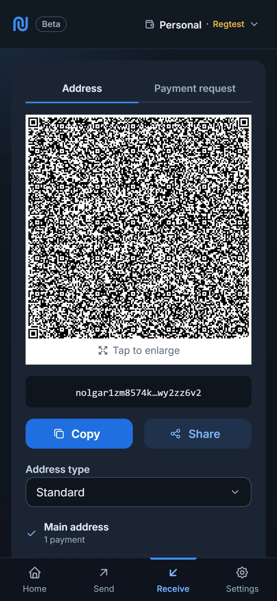
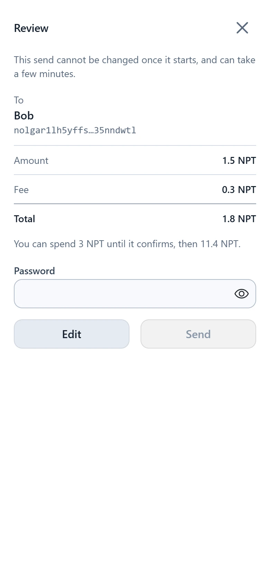
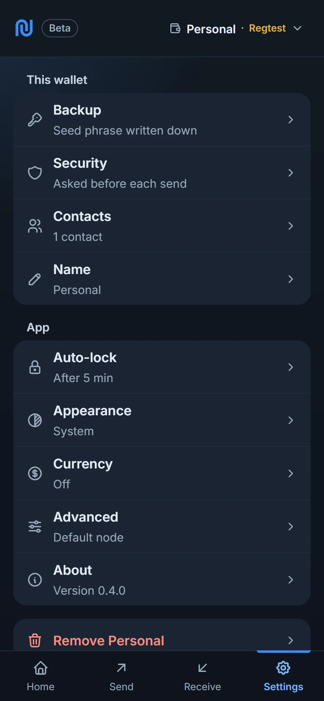
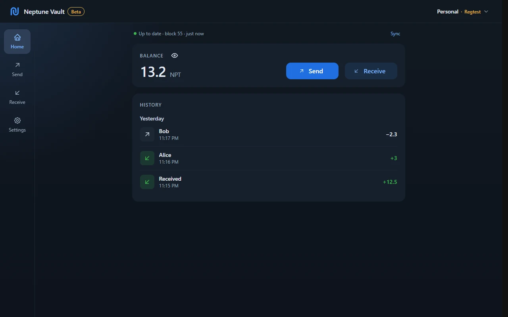

# Neptune Vault

A self-custodial wallet for [Neptune Cash](https://neptune.cash).

- **Your keys stay on your device.** The seed phrase is encrypted with your
  password and never leaves it.
- **Your device proves your transactions.** No server builds or signs
  anything for you.
- **Only the node you choose hears about your wallet.** No analytics, no
  tracking; [docs/PRIVACY.md](docs/PRIVACY.md) lists everything that leaves
  the device.
- **It runs in a browser** and installs as an app on a phone or a computer.
  Desktop apps for Windows, Linux and macOS, and an Android app, are in
  development; see [Platforms](#platforms).

> **Early software.** It works end to end on Mainnet, but it has not been
> independently audited and it changes often. A bug could lose funds. Use
> amounts you can afford to lose, and keep your seed phrase safe.

**Try it:** <https://vault.dev.useneptune.org>

<p align="center">
  
  
  
  
</p>
<p align="center"><sub>A demo wallet on Regtest, a local test network.</sub></p>

## Contents

- [Features](#features)
- [Platforms](#platforms)
- [Before you use it](#before-you-use-it)
- [Security and privacy](#security-and-privacy)
- [Backup and recovery](#backup-and-recovery)
- [Getting help](#getting-help)
- [Development](#development)
- [Documentation](#documentation)
- [Licence](#licence)

## Features

**Wallets**

- Create a wallet with a new 18-word seed phrase, which you confirm by
  filling in its missing words.
- Restore from a seed phrase or a backup file. A mistyped word is pointed
  out as you type.
- Keep several wallets on one device, each with its own seed phrase,
  password and backup, and switch between them in the header.

**Receiving**

- Three kinds of address, Standard, Short and View-only, each with a QR
  code. Make a new address for each payer and name it after them.
- Payment requests, as NIP-002 links or QR codes, with an amount, your name
  and a note.
- Incoming payments show as pending until they are in a block.

**Sending**

- A review before anything is sent: the amount, the fee and the total. The
  app asks for your password (or passkey) before each send; you can turn
  that off in Settings, Security.
- Fee presets (Low, Medium, High) or a fee of your own. Max sends everything
  that can be spent.
- Saved contacts. A typed or pasted address that is a contact shows its
  name; a name that came in a payment request is marked unverified.
- Pay up to 10 recipients in one transaction, with one proof and one fee,
  and add a note for yourself that History keeps.
- Scan a QR code with the camera, or from an image you choose or paste. In
  the Android app, a `neptunecash:` payment link opens Send, filled in.

**History**

- Payments by day, each with its details: the coins, and on Mainnet a link
  to each on the explorer.
- A send that the node has stopped carrying is marked "Not going through",
  and you can give up on it to free its coins.
- A send that was not sent can be removed from History once it can no
  longer go through.
- Hide every amount with one tap, for using the wallet where others can
  see.
- Rescan the chain, fast or from a block or a date.

**Security and settings**

- Passkey unlock where the browser supports it.
- The wallet locks after 1 to 30 minutes idle, when it goes to the
  background (at once, or after 30 seconds or 2 minutes), and from the
  header menu.
- Change your password, and export encrypted backup files.
- Light and dark themes, following the system or your choice.
- Optionally, an estimate of the balance in another currency. It is off by
  default, because it asks a price site
  ([docs/PRIVACY.md](docs/PRIVACY.md)).
- Diagnostics (Settings, Advanced) and Report a problem (Settings, About)
  show how this device runs the wallet, and copy the details only when you
  ask.

## Platforms

| Platform | Status |
|---|---|
| Android, Chrome (installed web app) | Main target. Tested on a Galaxy S24, including Mainnet sends. |
| Android app | In testing. Test builds by GitHub Actions, tested on a Galaxy S24, including a Mainnet send. Not released or signed for release yet; see [docs/ANDROID.md](docs/ANDROID.md). |
| iOS, Safari (installed web app) | Intended. Not tested yet. |
| Desktop browsers | Work. Good for trying the app out. |
| Windows desktop app | Builds and runs. Not signed yet. |
| Linux and macOS desktop apps | The release workflow can build them, but has not run yet. Not tested, not signed. |

The web app and the native apps (desktop and Android) share one interface.
The native apps run the wallet engine and the prover as native code rather
than WebAssembly, which is much faster: on a Galaxy S24, the Android app
proves a Mainnet send in 16 to 23 seconds, where the web app on the same
phone takes over a minute. They keep the wallet in the app's own storage
rather than in a browser's.

<p align="center">
  
</p>

## Before you use it

- **Install the web app.** On Android, open Chrome's menu and choose
  "Install app" or "Add to Home screen". A browser is much less likely to
  clear an installed app's storage, and Settings, Backup warns you when the
  browser has not promised to keep it.
- **Sending takes a minute or more in the web app.** The proof needs about
  1 GB of free memory and one to two minutes on a recent high-end phone,
  longer on others; devices with 4 GB of RAM or less may run out of memory.
  Keep the app open while it proves; where the browser allows, the screen
  stays on. A block that arrives meanwhile is usually no problem, and if the
  node refuses the send, the app proves it again and tells you, up to three
  attempts in all.
- **Choose how to restore.**
  - **Fast restore** takes seconds. The node's coin index finds your
    payments, so the node learns which payments are yours, and can
    recognise later ones, though not the amounts.
  - **Private restore** downloads and scans every block from a date you
    choose. From the start of Mainnet that is several gigabytes and hours of
    scanning, and the node learns nothing about your coins.
- **Your seed phrase is the only real backup.** Your password protects the
  wallet on this device. If you forget it, choose Forgot the password? when
  unlocking, and the seed phrase sets a new one. If you lose the seed
  phrase, you lose the funds.

## Security and privacy

- **Neptune's own code.** Keys, addresses, scanning and proving come from
  Neptune's own crates: WebAssembly in the web app, native code in the
  desktop and Android apps. Addresses and signatures match what
  neptune-core produces.
- **Encryption at rest.** The seed phrase is encrypted with AES-256-GCM,
  under a key derived from your password with Argon2id. A passkey can wrap
  the same key, and a key derived from the seed phrase wraps it too, so the
  phrase can set a new password.
- **What the node sees.** It never gets your seed phrase or password, and
  scanning happens on your device. It does see what the wallet asks: the
  blocks it scans, which pending payments are yours, the coins a send
  spends, and the sends. A fast restore, or a rebuild from the chain, also
  gives it identifiers made from your addresses, as above. The app shows
  the full list under Settings, About, Privacy statement.
- **What the chain shows.** Anyone can link the payments made to one
  address, and your own sends too, because their change returns to your
  main address. Amounts stay hidden. Give each payer a new address.
- **What the node is trusted for.** It cannot spend your coins or invent a
  payment without mining it, but it can hide payments or show an old chain.
  For amounts that matter, wait until History shows several blocks since a
  payment, and use a node you trust or run your own.
- **No tracking.** No analytics, telemetry or crash reports. Diagnostics and
  Report a problem send nothing.
- **Trusting the host.** A web wallet runs whatever code its host serves.
  - The app downloads a new build but never applies it while it is open.
    The build takes effect when you tap Update, or the next time the app
    starts.
  - The update strip names the waiting build and links the changes on
    GitHub.
  - Each deploy publishes a list of file hashes, so anyone can check what
    the site serves ([docs/HOSTING.md](docs/HOSTING.md)).
  - The desktop and Android apps carry their own files. The desktop apps
    only ask GitHub whether a newer release exists.

## Backup and recovery

- **Seed phrase.** Restores your funds in any wallet that supports
  Neptune's 18-word seed phrases, including this app on another device.
- **Backup file.** Export one from Settings, Backup, with your password. It
  restores the seed phrase, the network, the start block, your contacts,
  the names you gave your addresses, which addresses you have given out,
  who each send paid, with its amounts, fee and note, and your notes on
  payments received.
  - The seed phrase, the contacts, the address names, the addresses given
    out, the sends and the notes are encrypted.
  - The rest of the file is sealed, so the app refuses a file that has been
    changed, with a different message than for a wrong password.
  - Every version of the app reads backup files from earlier versions.
- **Password.** If you forget it, choose Forgot the password? when
  unlocking: the seed phrase sets a new one, and everything on this device
  stays. A wallet that an older version of the app last unlocked needs one
  more unlock with its password first; without that password, restore the
  seed phrase in another browser or on another device. A backup file made
  earlier still opens only with the password it was made with.

## Getting help

- **Bugs:** [open an issue](https://github.com/codewordneptune/neptune-vault/issues).
  - Tap Copy details under Settings, About, Report a problem, and paste them
    into the issue, with the network and what you did.
  - **Never share your seed phrase or a backup file.**
- **Questions:** the [Neptune Cash Telegram](https://t.me/neptune_project)
  or the [forum](https://talk.neptune.cash/).
- **News and guides:** <https://useneptune.org>

## Development

### Repository layout

```
web/                    the app: Vite, React, Mantine; wasm packages under public/wasm
crates/vault-core       wallet engine (keys, scanning, transactions, storage format), Rust to wasm
crates/vault-prover     transaction prover, Rust to wasm with threads
crates/vault-bridge     vault-core and the prover as native code, for the desktop and Android apps
crates/vault-fixtures   deterministic witnesses for prover tests
crates/vendor           neptune-consensus, neptune-primitives, triton-vm, twenty-first,
                        with small patches (see crates/vendor/VENDOR.md)
shells/tauri            the desktop and Android apps (Tauri 2)
fixtures/, test-vectors/  test inputs
docs/                   design, privacy, hosting, releases, Android
```

### Prerequisites

- Node 22
- Rust nightly, as pinned in `rust-toolchain.toml` (it pulls in `rust-src`
  and the `wasm32-unknown-unknown` target)
- [`wasm-pack`](https://wasm-bindgen.github.io/wasm-pack/)

### Run the web app

```bash
cd web
npm ci
npm run wasm:core      # crates/vault-core   -> web/public/wasm/core
npm run wasm:prover    # crates/vault-prover -> web/public/wasm/prover
npm run dev            # http://localhost:4400
```

The first wasm build is slow, because the standard library is rebuilt with
atomics for threads. Later builds are quick.

The dev server sends the cross-origin isolation headers that the wallet
engine and the prover need (without them the app does not start), and
proxies `/regtest-node` to a regtest node at `127.0.0.1:9797`.

### Tests

```bash
cd web && npm test                                   # web app (vitest)
cd web && npm run typecheck
cargo test -p vault-core                             # wallet engine, native
cargo test -p vault-bridge                           # the native bridge the desktop and Android apps use
cargo test --release -p vault-prover -- --ignored    # full proof round trip, takes minutes
```

The web tests run the built wallet engine, so run `npm run wasm:core` first.

### Local regtest node

Use neptune-core 0.17 or later. Start the node with JSON-RPC, the coin index
(for fast restores) and proof upgrading; without upgrading, transactions
never leave the mempool on regtest:

```bash
neptune-core --network regtest --data-dir <dir> --listen-rpc 127.0.0.1:9797 --rpc-modules node,chain,wallet,archival,mempool,utxoindex --utxo-index --rpc-port 9799 --peer-port 9798 --max-num-peers 0 --disable-cookie-hint --tx-proving-capability=singleproof --tx-proof-upgrading
```

Then:

1. Fund the node's wallet:

   ```bash
   neptune-cli --data-dir <dir> --port 9799 mine-blocks-to-wallet 5
   ```

2. In the app, make a first wallet (it always goes on Mainnet), then tick
   Developer networks in Settings, Advanced.
3. Choose Add a wallet in the header's wallet menu, pick Regtest in the
   Network line under its card, and create the wallet.
4. Send it coins from the node, and mine a block:

   ```bash
   neptune-cli --data-dir <dir> --port 9799 send <app address> 10 0.1 vault on-chain on-chain
   ```

   ```bash
   neptune-cli --data-dir <dir> --port 9799 mine-blocks-to-wallet 1
   ```

Things to know about regtest:

- Mine only after the node logs `single proof: Done`.
- Restarting the node empties its mempool.
- Regtest nodes accept only mock proofs, so the app skips real proving on
  regtest.

### Networks and nodes

- New wallets go on Mainnet unless Developer networks is ticked in
  Settings, Advanced. Then Add a wallet also offers Testnet and Regtest,
  and the wallet menu in the header switches between all three. With it
  off, a test network stays in that menu only while a wallet is on it. Each
  wallet belongs to one network, and a backup file restores on the network
  it was saved on.
- You set the node in Settings, Advanced. The node must send CORS headers,
  because the app's page calls it directly, in the desktop and Android apps
  too; the default Mainnet node does.
- Every network is past the delta fork (Mainnet block 55,000), so every
  proof is in the post-fork format (claim version 8).

### Desktop app

```bash
cd web && npm ci
```

```bash
cd shells/tauri && npx --prefix ../../web tauri dev
```

```bash
cd shells/tauri && npx --prefix ../../web tauri build
```

- `tauri dev` runs the desktop app against the web dev server.
- `tauri build` makes the installers. On Windows, keep `CARGO_TARGET_DIR`
  short (for example `C:/nvnative`), or the linker can fail on long paths.
  It also replaces `web/dist` with the desktop page, so run `npm run build`
  in `web` again before you deploy the web app.
- Pushing a `desktop-v<version>` tag builds all platforms and attaches the
  installers to a draft pre-release.
- Details, and the signing and updater keys still needed:
  [docs/DESKTOP-RELEASE.md](docs/DESKTOP-RELEASE.md).

### Versions and deployment

- The app has one version: the `version` field in `web/package.json`. It
  appears under About and on Diagnostics and Report a problem, with the
  commit and the build time. Each release is tagged `v<version>`; desktop
  releases are tagged `desktop-v<version>`.
- Each push to `main` that touches the app or the crates builds the wasm
  packages, runs the tests and deploys to Azure Static Web Apps
  ([docs/HOSTING.md](docs/HOSTING.md)).
- An open web app checks for a new build every hour, and whenever it comes
  back to the front. Each build ships a `version.json` (version, commit,
  build time), which the update strip reads to name the waiting build and
  link to what changed.

## Documentation

- [docs/ARCHITECTURE.md](docs/ARCHITECTURE.md): the design and the data-format policy
- [docs/PRIVACY.md](docs/PRIVACY.md): what leaves the device, and who sees it
- [docs/HOSTING.md](docs/HOSTING.md): hosting, headers and verifying a deploy
- [docs/DESKTOP-RELEASE.md](docs/DESKTOP-RELEASE.md): building and releasing the desktop apps
- [docs/ANDROID.md](docs/ANDROID.md): the Android app, its plan and where it stands
- [docs/M0-BENCHMARK.md](docs/M0-BENCHMARK.md): the measured cost of proving in a browser (historical record)
- [docs/screenshots/capture.mjs](docs/screenshots/capture.mjs): how the screenshots above are taken, and the demo wallet they show

## Licence

Not decided yet.
